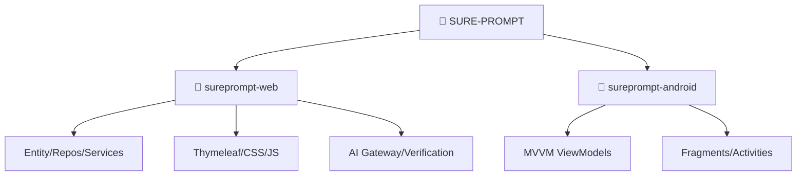

<div align="center">
  
  
  # ⚡ SurePrompt ⚡
  **The Free Technical Prompt Community for CS Students**
  *Learn Better. Prompt Smarter. Share Freely.*

  <br>
<<<<<<< HEAD
=======

>>>>>>> 66e8c8f0ed2bff18cc4b1d9fa2d527af9ec34021

  <div align="center">
    <a href="https://github.com/suresurya/SURE-PROMPT/stargazers">
      
    </a>
    <br>
<<<<<<< HEAD
=======
    <br><br>
>>>>>>> 66e8c8f0ed2bff18cc4b1d9fa2d527af9ec34021
    <a href="https://github.com/suresurya/SURE-PROMPT/stargazers">
      
    </a>
  </div>
  
  <br>
  <em>Your support helps us build the future of technical education. ✨</em>
</div>

---

## 🚀 The Problem SurePrompt Solves

Every engineering and CS student uses **ChatGPT, Claude, or Gemini** every single day. They use it to understand DSA concepts, debug code, solve math problems, design systems, and prepare for interviews. 

**But here is the problem:** The best prompts that produce the best AI responses disappear immediately after use.
A student at VIT crafts a perfect prompt that explains Dynamic Programming with a dry run, step-by-step code, and time complexity. The AI gives an excellent response. The student shares it in a WhatsApp group of 20 friends. In 48 hours it is buried under memes. A student at NIT struggling with the exact same topic never finds it.

**SurePrompt** is the permanent, searchable, social home for technical AI prompts made by students, for students.

---

## 🌐 What SurePrompt Does

SurePrompt is a hybrid ecosystem consisting of both a **Web Platform** and an **Android App** where CS students share, discover, and save technical AI prompts. 

Every post on SurePrompt has three parts:
1. The **exact prompt text** the student used.
2. The **AI-generated output** it produced.
3. Metadata like **topic tags, difficulty level**, and the **AI platform used**.

Think of it like Instagram but only for technical prompts. Scroll a feed from people you follow, explore trending prompts, like, save, comment, and copy any prompt to your clipboard in one click!

---

## 🤖 The Unique AI Layer (Web Platform)

SurePrompt features a powerful AI layer built on top of social features. Users can securely connect their own Gemini, OpenAI, or Claude API keys to unlock:

| AI Feature | What it does | Who sees the result? |
| :--- | :--- | :--- |
| **Prompt Verification** | Tests if the prompt actually produces a useful response. | Everyone — *Verified badge shown publicly!* |
| **Quality Scoring** | Rates prompt 1 to 10 based on clarity, structure, and usefulness. | Everyone — *Score shown on card & profile!* |
| **AI Improvement** | AI rewrites the prompt to be clearer and more effective. | Only the poster *(before they publish)* |
| **Auto Tag Generation** | Automatically suggests the correct topic tags and difficulty level. | Only the poster *(pre-fills the form)* |
| **Try This Prompt** | Runs the prompt live using the user's API key. | The executor |

---

## 🛠️ Hybrid Tech Stack

<div align="center">
  <table>
    <tr>
      <th>Backend (Spring Boot)</th>
      <th>Web Frontend (Thymeleaf)</th>
      <th>Android Native (Java)</th>
    </tr>
    <tr>
      <td>Java 21 LTS<br>Spring Boot 3.5.13<br>Spring Data JPA<br>PostgreSQL (Supabase)<br>Google + GitHub OAuth2</td>
      <td>Thymeleaf<br>HTML / CSS3 / JS<br>Premium Glassmorphism<br>Highlight.js</td>
      <td>Android SDK 26+<br>MVVM Architecture<br>Retrofit2<br>Navigation Component<br>Glide</td>
    </tr>
  </table>
</div>

---

## 📂 Hybrid Architecture



<details>
<summary><b>📂 VIEW FULL DIRECTORY TREE</b></summary>

```text
📁 SURE-PROMPT/        (Root — contains both web and Android projects)
│
├── 📁 sureprompt-web/ (Spring Boot Maven project — website and API)
│   ├── 📄 pom.xml              (ALL Java dependencies)
│   ├── 📄 .env                 (Secret keys — DB password, OAuth. Never commit)
│   ├── 📄 Dockerfile           (Packages app for deployment)
│   │
│   ├── 📁 src/main/java/com/sureprompt/
│   │   ├── 📁 entity/          (JPA entities: User, Prompt, Tag, Follow, etc.)
│   │   ├── 📁 repository/      (Spring Data JPA interfaces)
│   │   ├── 📁 service/         (Business logic: FeedService, UserService, etc.)
│   │   │   └── 📁 ai/          (AI services: Verification, Scoring, AutoTag)
│   │   ├── 📁 controller/      (REST + Web controllers, Android API /api/v1/)
│   │   ├── 📁 dto/             (Data transfer objects)
│   │   ├── 📁 security/        (OAuth2 Security Config)
│   │   └── 📁 exception/       (Global exception handlers)
│   │
│   ├── 📁 src/main/resources/
│   │   ├── 📄 application.properties (Config)
│   │   ├── 📁 db/migration/    (Flyway SQL: V1__create_users to V13__seed_tags)
│   │   ├── 📁 templates/       (Thymeleaf HTML: index, explore, profile, admin)
│   │   └── 📁 static/          (Premium CSS Design System & JS behaviors)
│
└── 📁 sureprompt-android/ (Android Studio project)
    ├── 📄 build.gradle         (Project-level dependencies)
    ├── 📁 app/src/main/java/com/sureprompt/
    │   ├── 📁 activity/        (LoginActivity, MainActivity)
    │   ├── 📁 fragment/        (Feed, Explore, Profile, Detail, Post fragments)
    │   ├── 📁 viewmodel/       (MVVM ViewModels for state retention)
    │   ├── 📁 repository/      (Remote data fetching)
    │   ├── 📁 api/             (Retrofit Client & Auth interceptors)
    │   ├── 📁 model/           (POJOs for API responses)
    │   └── 📁 di/              (Dagger Hilt Modules)
    └── 📁 app/src/main/res/    (XML layouts, navigation graphs, drawables)
```
</details>

---

## 🤝 Contributing

We welcome all contributions from the community! Whether you are a student learning Spring Boot or an experienced Android Developer, we'd love your help to make this the best platform for CS students.

1. **Drop a Star!** ⭐
2. **Fork the Project**
3. Create your Feature Branch (`git checkout -b feature/AmazingFeature`)
4. Commit your Changes (`git commit -m 'Add some AmazingFeature'`)
5. Push to the Branch (`git push origin feature/AmazingFeature`)
6. **Open a Pull Request** or raise an **Issue**!

All contributors are welcome! 🎉

---

<div align="center">
  <p><b>Free Forever | Open Source MIT | No Ads | No Paywalls | Community Owned</b></p>
  
</div>
